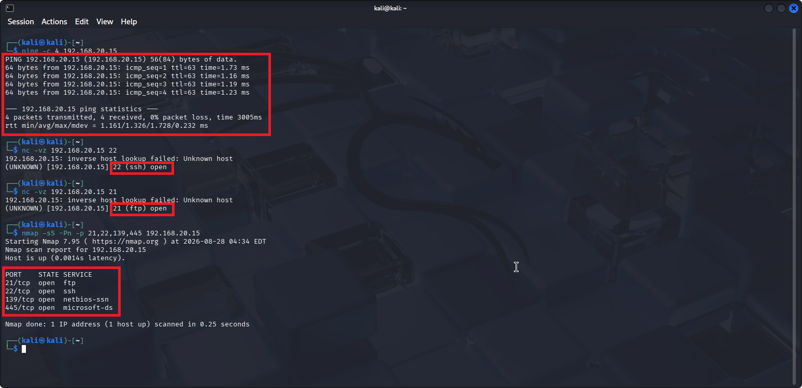
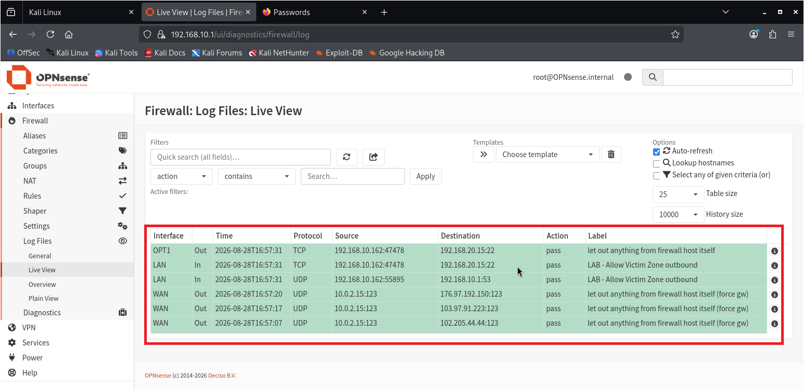
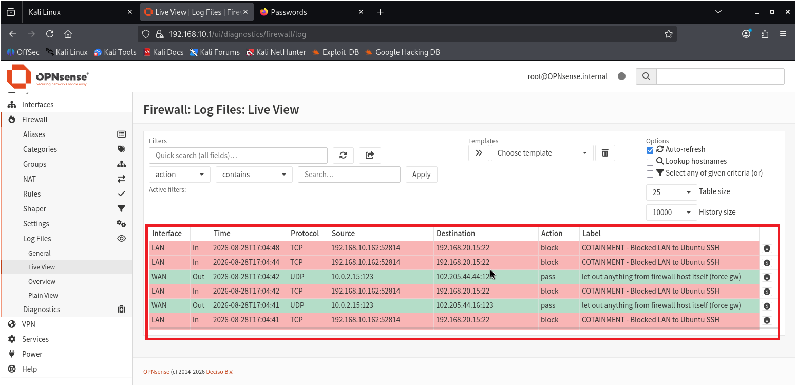
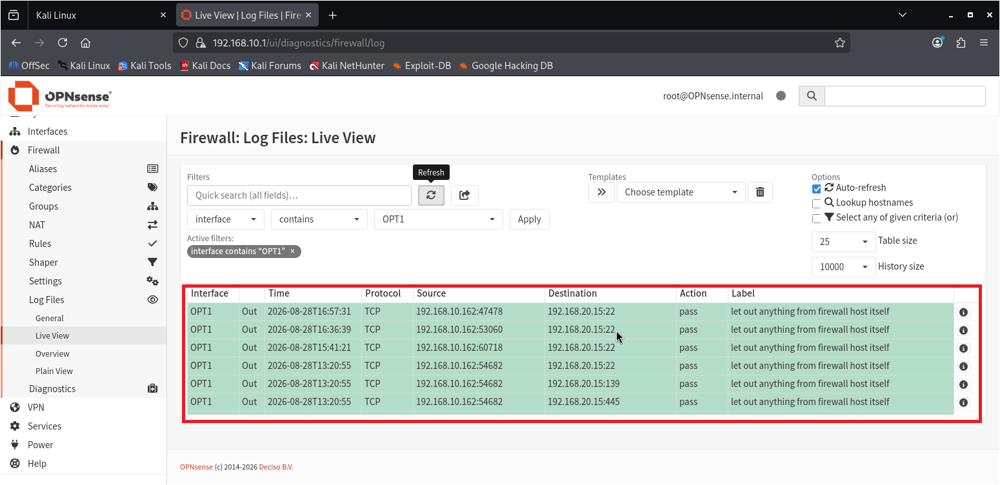

# 🔥 Firewall Threat Prevention & Incident Containment Lab

---

## Overview

A hands-on network security lab demonstrating perimeter defense, network segmentation, and firewall-based threat containment. 
This project builds on my existing detection and response work (IDS + SIEM + Incident Response Playbook) by adding the **prevention layer**, 
reducing attack surface and controlling traffic flow before threats reach protected systems.

## Project Overview

I built an isolated virtual security environment to simulate a segmented network with firewall-enforced boundary protection between an attacker host and a protected victim host.

**Environment Components:**

- **Kali Linux** — Attacker/test host used to simulate reconnaissance and attack traffic
- **Ubuntu** — Victim host representing a protected internal system
- **OPNsense** — Open-source network firewall acting as the security boundary between networks
- **VirtualBox** — Virtualization platform hosting all three machines
- **Segmented Networks** — Separate attacker-side and victim-side network segments, with OPNsense positioned as the controlling boundary between them

This mirrors real-world network segmentation practices used in production environments — isolating untrusted/external-facing systems from protected internal assets, with the firewall enforcing what traffic is permitted to cross that boundary.

## Purpose

This lab demonstrates practical firewall configuration and network segmentation skills — core competencies for SOC and security operations roles, 
complementing my existing detection (Suricata/Splunk) and response (Incident Response Playbook) work.

## Network Configuration

| Device      | Interface  | Network      |  IP           |
| ----------- | ---------- | ------------ | ------------  |
| OPNsense    | WAN/em0    | NAT          | 10.0.2.15     |
| OPNsense    | LAN/em1    | opnsense-lan | 192.168.10.1  |          |
| OPNsense    | OPT1/em2   | victim_Zone  | 192.168.20.1  |
| Kali        | eth0       | opnsense-lan | 192.168.10.15 |
| Ubuntu      | enp0s3     | Victim_Zone  | 192.168.20.50 |

## Firewall Policy
Traffic originating from the attacker-side LAN towards the Ubuntu victim was initially permitted to establish
a baseline. A subsequent firewall policy was introduced to restrict TCP/22 access to the victim, demonstrating
network-level containment.

## Verification
- Active host verification conducted via ICMP ping to the target machine ('192.168.20.15').
- Successful service validation performed on critical target ports using Netcat banners ('nc -vz').
- Final Nmap reconnaissance confirming open ports '21', '22', '139', and '445' are reachable across network segments.

## Baseline — Allowed
- TCP/22 connection from Kali to Ubuntu successfully established

## Containment — Blocked
- After applying the firewall block policy the same TCP/22 connection attempt was prevented

## OPT1 Validation
- Successful connectivity between the protected victim zone and OPNsense OPT1 confirmed
that the victim network was correctly routed through firewall

## Security Outcome
The lab successfully demonstrated network segmentation and firewall-based containment.
The attacker and victim systems were placed on separate networks, with OPNsense acting as the Layer-3
security boundary. A controlled TCP/22 connection was first validated and subsequently blocked through
firewall policy enforcement.
## Related Projects

- [IDS-Threat-Detection-Lab](https://github.com/Ug111/IDS-Threat-Detection-Lab) — Network-based threat detection
- [SSH-Brute-Force-Detection-Splunk](https://github.com/Ug111/SSH-Brute-Force-Detection-Splunk) — SIEM correlation and detection
- [Incident-Response-Playbook](https://github.com/Ug111/Incident-Response-Playbook) — Response workflow this lab feeds into
